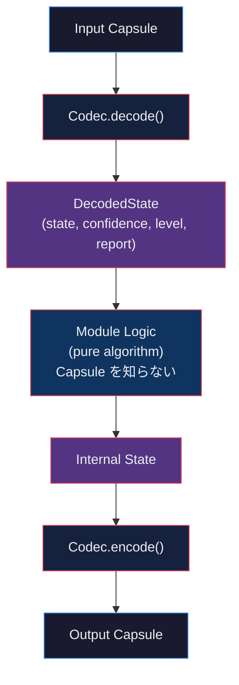
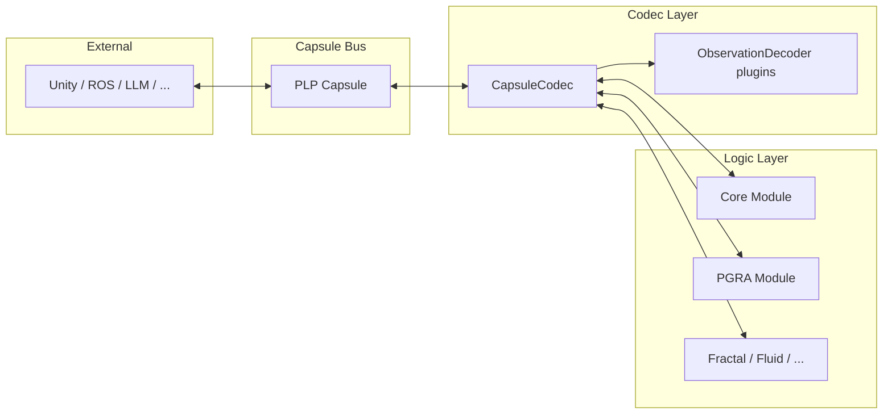
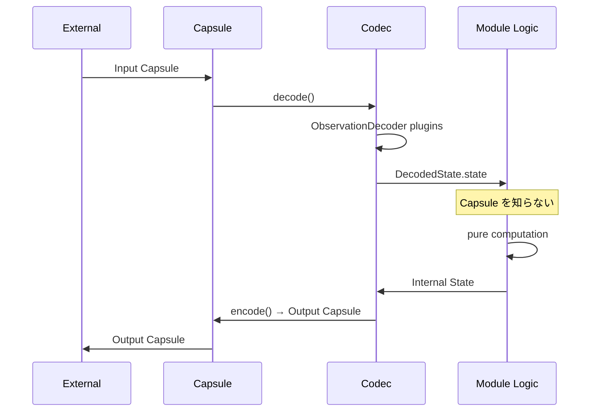

# PLP Architecture

**Version**: 1.0  
**Date**: 2026-07-24  
**Related**: SPEC.md, CAPSULE.md, CODEC_SPEC.md

---

## 1. High-Level View — Capsule as Universal Bus

```text
                    ┌──────────────────────────────────────┐
                    │           External World             │
                    │  Unity / ROS / MuJoCo / Live2D / LLM │
                    └──────────────────┬───────────────────┘
                                       │ Capsule only
                                       ▼
┌──────────────────────────────────────────────────────────────────────────┐
│                         PLP Capsule Bus                                  │
│                                                                          │
│   Capsule ──► Module ──► Capsule ──► Module ──► Capsule ──► ...          │
│                                                                          │
└──────────────────────────────────────────────────────────────────────────┘
          │                              │
          │                              │
          ▼                              ▼
   ┌─────────────┐                ┌─────────────┐
   │ Core Module │                │ PGRA Module │
   │ (定義)      │                │ (収束計算)  │
   └─────────────┘                └─────────────┘
```

すべての外部システムは **Capsule だけ** を読めば接続できる。

---

## 2. Module Internal Structure (Codec + Logic)



```text
Input Capsule
      │
      ▼
Codec.decode()
      │
      ▼
DecodedState (state, confidence, level, evidence, report)
      │
      ▼
Module Logic  ←── 純粋。Capsule を一切知らない
      │
      ▼
Internal State
      │
      ▼
Codec.encode()
      │
      ▼
Output Capsule
```

---

## 3. Layer Responsibilities



| Layer | Responsibility | Does NOT do |
|-------|----------------|-------------|
| **Capsule** | 輸送・観測・時系列・親子関係 | 意味解釈・計算 |
| **Codec** | Capsule ⇔ 内部状態の変換 | 推論・学習・Simulation・拘束求解 |
| **Module Logic** | 内部状態に対する処理 | Capsule の直接操作 |
| **External** | 意味・UI・制御・表示 | PLP 内部状態の直接改変 |

---

## 4. Codec Detail (Reference: PGRACodec)

```text
                    Capsule
                       │
          ┌────────────┴────────────┐
          ▼                         ▼
   ObservationDecoder          encode path
   Registry                         │
          │                         ▼
   ┌──────┴──────┐            CapsuleBuilder
   │ Geometry    │            + Observers
   │ Particles   │                  │
   │ Radius      │                  ▼
   │ (Energy…)   │            ObservationBlocks
   └──────┬──────┘                  │
          ▼                         ▼
   DecodedState                 Capsule
   ├ state
   ├ confidence   (evidence-based)
   ├ level        (EXACT/PARTIAL/MINIMAL/EMPTY)
   ├ evidence
   └ report       (used/missing/reconstructed/…)
```

---

## 5. Pipeline Composition

```text
Sensor / Input
      │
      ▼
   Capsule₀
      │
      ▼
┌─────────────┐
│ CoreModule  │  世界の定義・検証
└──────┬──────┘
       │ Capsule₁
       ▼
┌─────────────┐
│ PGRAModule  │  幾何緩和（時間を進めない収束）
└──────┬──────┘
       │ Capsule₂
       ▼
┌─────────────┐
│ (Future)    │  Fractal / Renderer / Robotics / …
└──────┬──────┘
       │ Capsuleₙ
       ▼
   LLM / Unity / ROS / …
```

各 Module は同じ契約だけを実装する：

```text
process(capsule: PLPCapsule) -> PLPCapsule
```

---

## 6. Data Flow (Round-trip)



---

## 7. Package Map

```text
PLP/
├── plp_capsule.py          ← Capsule 規格本体
├── CODEC_SPEC.md           ← Codec 正式仕様
├── ARCHITECTURE.md         ← 本図
├── core/                   ← 世界の定義（Particle0 / Geometry / Constraint / Clock）
├── PGRA/                   ← 幾何緩和 Logic
├── codecs/
│   ├── base.py             ← CapsuleCodec / CapsuleModule Protocol
│   └── pgra_codec.py       ← リファレンス実装
└── modules/                ← 監視系（将来 Observer へ寄せる）
```

---

## 8. Boundary Summary (Non-Goals reminder)

```text
┌─────────────────────────────────────────────────────┐
│  Codec がやらないこと                                │
│  ✗ 推論  ✗ 学習  ✗ 意味解釈  ✗ Simulation           │
│  ✗ Constraint 求解  ✗ 状態の破壊的変更               │
│  ✗ 複数 Capsule の融合                               │
└─────────────────────────────────────────────────────┘
```

詳細は `CODEC_SPEC.md` §11 Non-Goals を参照。

---

**Status**: Living document  
実験は忠実に実際行って。
