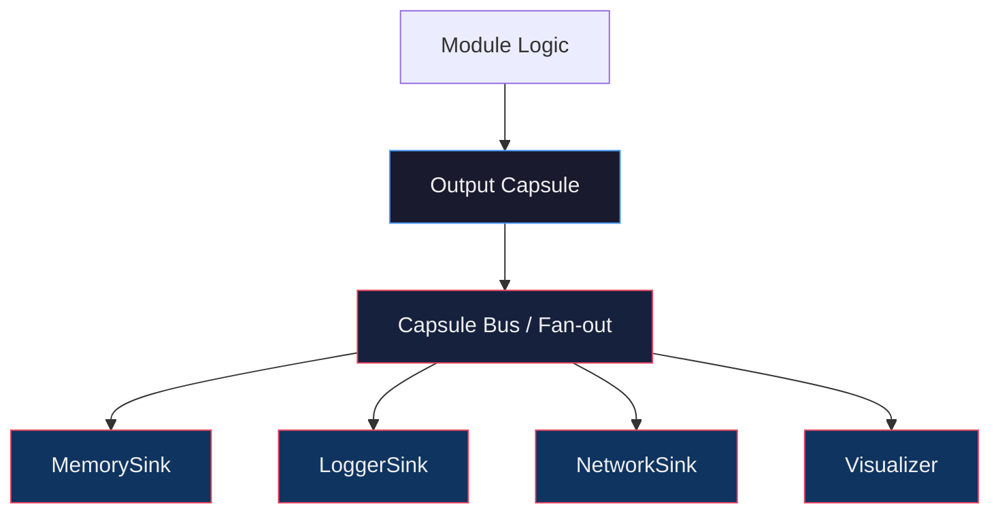

# PLP Architecture

**Version**: 1.1  
**Date**: 2026-07-24  
**Related**: SPEC.md, CAPSULE.md, CODEC_SPEC.md, HANDOVER.md

---

## 0. Guiding Principle

> **Capsule だけを知る。互いに知らない。**

PGRA は Memory を知らない。  
Memory は PGRA を知らない。  
どちらも Capsule だけを知る。

機能を横並びで増やさない。  
先にレイヤーを固定し、置き場所を決めてから実装する。

---

## 1. Layer Model (Target)

```text
plp/
│
├── core/                 # プロトコル核（規格・契約）
│   ├── capsule           # 輸送規格
│   ├── observation       # 観測ブロック
│   ├── codec             # Capsule ⇔ State
│   ├── module            # process(capsule)->capsule 契約
│   └── pipeline          # 直列合成
│
├── runtime/              # 実行時基盤（状態を「持つ・流す」）
│   ├── memory/           # Capsule Chain の保存・差異・Replay
│   ├── replay/
│   ├── scheduler/
│   └── bus/              # Capsule 配布（fan-out）
│
├── modules/              # 処理系（Logic）
│   ├── pgra/
│   ├── fractal/
│   ├── physics/
│   └── ...
│
├── io/                   # 入出力 Sink / Source
│   ├── store/
│   ├── logger/
│   ├── network/
│   └── visualizer/
│
├── observers/            # encode 用の純粋観測
├── references/           # 幾何基準など
└── specs/                # SPEC / CODEC_SPEC / CAPSULE / ...
```

| Layer | 役割 | 例 |
|-------|------|-----|
| **core** | 規格と契約。意味も計算も持たない | Capsule, Codec Protocol, Module Protocol, Pipeline |
| **runtime** | 実行時に Capsule を保持・再生・配布する | Memory, Replay, Scheduler, Bus |
| **modules** | 内部状態に対する純粋処理 | PGRA, Fractal, Physics |
| **io** | 外部への入出力（Consumer / Producer） | Logger, Network, Store backend |

---

## 2. Module vs Sink

### Module（処理系）

```text
process(capsule) -> capsule
```

- Codec で decode → Logic → encode
- 新しい Capsule を**産む**
- 例: PGRAModule, CoreModule

### Sink（消費系）

```text
consume(capsule) -> None
```

- Capsule を受け取り、保存・記録・転送する
- Capsule を**変更しない**
- Observation を**生成しない**
- 例: MemorySink, LoggerSink, NetworkSink

Memory は Module ではなく **Sink** である。

```text
# 旧（曖昧）
MemoryModule.process(capsule)

# 新（責務明確）
MemorySink.consume(capsule)
```

---

## 3. Event Fan-out（疎結合）

```text
Capsule Produced
        │
        ├──► MemorySink
        ├──► LoggerSink
        ├──► ReplayRecorder
        ├──► Visualizer
        └──► NetworkTransport
```



Producer（Module）は Consumer（Sink）を知らない。  
Bus が Capsule を配るだけである。

---

## 4. Pipeline + Sinks

```text
Input Capsule
      │
      ▼
┌─────────────┐
│ CoreModule  │  Module
└──────┬──────┘
       │ Capsule
       ▼
┌─────────────┐
│ PGRAModule  │  Module
└──────┬──────┘
       │ Capsule ──────────────────────────┐
       ▼                                   │
   (next Module…)                          ▼
                                    ┌─────────────┐
                                    │ MemorySink  │  Runtime
                                    ├─────────────┤
                                    │ LoggerSink  │  IO
                                    └─────────────┘
```

直列は Module の Pipeline。  
横の分岐は Sink の Fan-out。

---

## 5. Memory の位置づけ

```text
runtime/memory/
  ├── store.py          # append-only Capsule Index + Episodes
  ├── difference.py     # Difference First
  ├── replay.py         # 復元のみ（Simulation ではない）
  ├── sink.py           # MemorySink.consume(capsule)
  └── types.py          # Episode / Diff / Drift / Velocity
```

- **公理**: Immutable / Episode Chain / Difference First / Replayable / Semantic-Free
- PGRA の横並び機能ではない
- Runtime の一部として Capsule Chain を保持する

---

## 6. core 契約（要約）

```text
CapsuleCodec
  decode(capsule) -> DecodedState
  encode(state, ...) -> capsule

CapsuleModule
  process(capsule) -> capsule

CapsuleSink
  consume(capsule) -> None

Pipeline
  modules: list[CapsuleModule]
  sinks:   list[CapsuleSink]    # 各段の出力後に fan-out 可能
  run(capsule) -> capsule
```

---

## 7. 現リポジトリとの対応（移行方針）

現状はフラットに近い。目標レイヤーへの対応関係：

| 現在 | 目標 |
|------|------|
| `plp_capsule.py` | `core/capsule` |
| `codecs/` | `core/codec` + module 側の参照実装 |
| `core/` (Particle0…) | 世界定義は `modules/core_world` または `core/world` に整理 |
| `PGRA/` | `modules/pgra` |
| `modules/` (monitors) | `observers/` |
| （未）Memory | `runtime/memory` |
| SPEC / CODEC_SPEC / … | `specs/` |

**移行原則**

1. 仕様・図を先に固定する（本ドキュメント）
2. 新規コードは目標レイヤーの場所に置く
3. 既存コードは壊さず、段階的に移動する
4. 機能追加より「置き場所の固定」を優先する

---

## 8. Module 内部（従来どおり）

```text
Input Capsule
      │
      ▼
Codec.decode() → DecodedState
      │
      ▼
Module Logic（Capsule を知らない）
      │
      ▼
Codec.encode() → Output Capsule
```

詳細は CODEC_SPEC.md / 旧 §2 を参照。

---

## 9. Non-Goals（レイヤー境界）

| 層 | やらないこと |
|----|--------------|
| **core** | 計算・永続化・ネットワーク |
| **runtime/memory** | 推論・意味・Capsule 変更・Observation 生成 |
| **modules** | Capsule の永続化・他 Module の直接呼び出し |
| **io** | 物理計算・幾何緩和 |

---

## 10. 一言

> 機能を増やす前に、**置き場所を決める。**  
> Capsule だけを共有し、Module と Sink を分ける。  
> Memory は Runtime の Sink である。

実験は忠実に実際行って。
